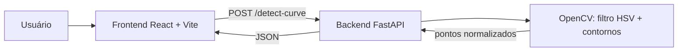
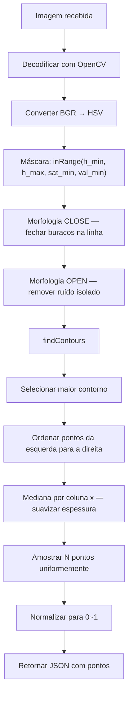

# GrafoCurva

Aplicação web para digitalizar automaticamente curvas de excitação (log-log
U(V) × Io(mA)) a partir de imagens de grafos. O backend detecta a linha azul
com OpenCV e devolve pontos normalizados; o frontend React/Vite permite enviar
a imagem, visualizar a curva e trabalhar com as medições.

---

## Arquitetura



| Módulo | Caminho | Stack |
|--------|---------|-------|
| **Backend** | `src/backend` | Python 3.10+, FastAPI, Uvicorn, OpenCV, NumPy |
| **Frontend** | `src/frontend` | React 19, Vite, Tailwind CSS |

---

## Estrutura do repositório

```
.
├── README.md                     ← este arquivo
└── src/
    ├── backend/                  ← API de detecção (OpenCV)
    │   ├── README.md
    │   ├── requirements.txt
    │   ├── main.py               ← servidor FastAPI
    │   ├── core/                 ← lógica de detecção (curva, plot, eixos)
    │   └── tests/                ← testes do backend
    └── frontend/                 ← SPA React + Vite
        ├── README.md
        └── src/                  ← componentes, contextos, serviços, hooks
```

---

## Pré-requisitos

- **Python 3.10+** e `pip` (backend)
- **Node.js** e `npm` (frontend)

---

## Como executar

### 1. Backend

```bash
cd src/backend

# (Recomendado) ambiente virtual
python -m venv .venv
.venv\Scripts\activate        # Windows
# source .venv/bin/activate   # Linux / macOS

pip install -r requirements.txt
python main.py
```

O servidor inicia em **http://localhost:8000** com hot-reload ativado.

> **Swagger UI:** http://localhost:8000/docs
> **ReDoc:** http://localhost:8000/redoc

### 2. Frontend

Em outro terminal, a partir da raiz do repositório:

```bash
cd src/frontend
npm install
npm run dev
```

Acesse [http://127.0.0.1:5173/](http://127.0.0.1:5173/). O servidor Vite atualiza
a página automaticamente durante as alterações no código. Para encerrá-lo,
pressione `Ctrl+C`.

**Outros comandos do frontend:**

```bash
npm run lint     # verificação de lint (oxlint)
npm run build    # versão de produção
npm run preview  # visualiza localmente a build de produção
```

---

## API do backend

### `GET /health`

Verifica se o servidor está ativo.

```json
{ "status": "ok", "service": "GrafoCurva OpenCV API" }
```

### `POST /detect-curve`

Recebe uma imagem e retorna os pontos da curva azul detectada.

**Body:** `multipart/form-data`

| Campo | Tipo | Descrição |
|-------|------|-----------|
| `file` | file | Imagem do grafo (PNG, JPG, BMP…) |

**Parâmetros de query (opcionais):**

| Parâmetro | Padrão | Descrição |
|-----------|--------|-----------|
| `max_points` | `50` | Número máximo de pontos retornados (5–500) |
| `h_min` | `100` | Matiz HSV mínimo do azul (0–179) |
| `h_max` | `140` | Matiz HSV máximo do azul (0–179) |
| `sat_min` | `80` | Saturação mínima (0–255) |
| `val_min` | `30` | Brilho mínimo (0–255) — use baixo para azul escuro/navy |

**Exemplo (curl):**

```bash
curl -X POST "http://localhost:8000/detect-curve?max_points=50" \
     -F "file=@minha_curva.png"
```

**Resposta de sucesso (200):**

```json
{
  "points": [
    { "x": 0.082, "y": 0.121 },
    { "x": 0.115, "y": 0.198 },
    { "x": 0.891, "y": 0.834 }
  ],
  "points_count": 50,
  "image_width": 1253,
  "image_height": 876,
  "mask_pixels": 4320,
  "error": ""
}
```

**Convenção das coordenadas normalizadas:**

```text
y=1 (U máximo)
  ┌──────────────┐
  │    curva     │
  │  detectada   │
  └──────────────┘
x=0             x=1
(Io mínimo)  (Io máximo)
y=0 (U mínimo)
```

- `x ∈ [0, 1]` → posição horizontal (Io, da esquerda para a direita)
- `y ∈ [0, 1]` → posição vertical invertida (U, de baixo para cima)

**Resposta de erro (422):**

```json
{
  "detail": "Detecção falhou: Nenhum pixel azul encontrado (h_min=100, h_max=140). Ajuste os parâmetros de cor ou verifique a imagem."
}
```

---

## Como funciona o algoritmo



---

## Ajuste da faixa de azul (HSV)

Se a linha não for detectada corretamente, ajuste `h_min` e `h_max`:

| Tom de azul | h_min | h_max | sat_min | val_min |
|---|---|---|---|---|
| **Navy / azul escuro** *(padrão)* | 100 | 140 | 80 | 30 |
| Azul padrão (caneta) | 100 | 130 | 100 | 80 |
| Azul ciano | 85 | 110 | 100 | 80 |
| Azul elétrico/brilhante | 105 | 125 | 150 | 100 |
| Azul royal | 110 | 135 | 80 | 50 |

> **Dica:** para inspecionar o HSV de um pixel, use a ferramenta de seleção de
> cor do GIMP, Photoshop ou Paint.NET e converta RGB → HSV. No OpenCV, o matiz
> (H) vai de 0 a 179 (metade do padrão 0–360°).

---

## CORS e segurança

Em desenvolvimento, o backend aceita requisições de qualquer origem
(`allow_origins=["*"]`). Para produção, edite `main.py` e restrinja ao domínio
do frontend:

```python
allow_origins=["https://meu-dominio.com"]
```

---

## Documentação detalhada

- [`src/backend/README.md`](src/backend/README.md) — detalhes da API e do processamento OpenCV
- [`src/frontend/README.md`](src/frontend/README.md) — comandos e uso do app React
